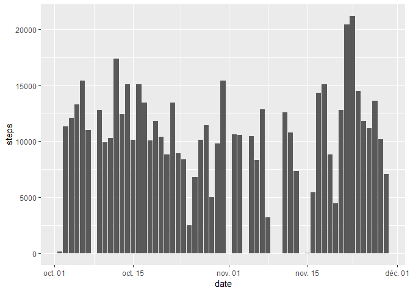
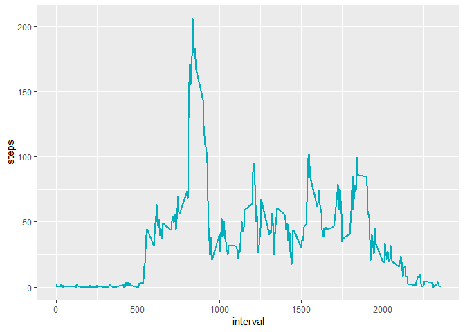
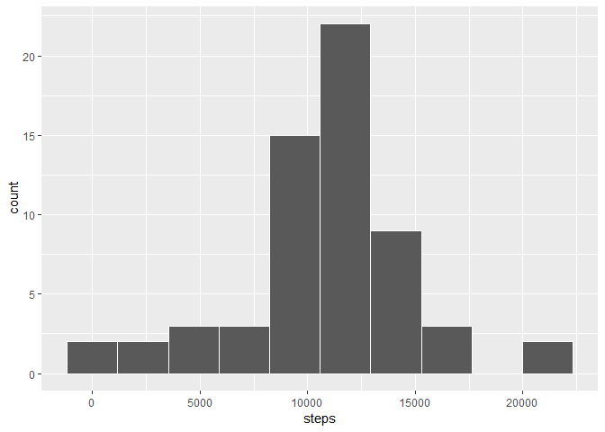
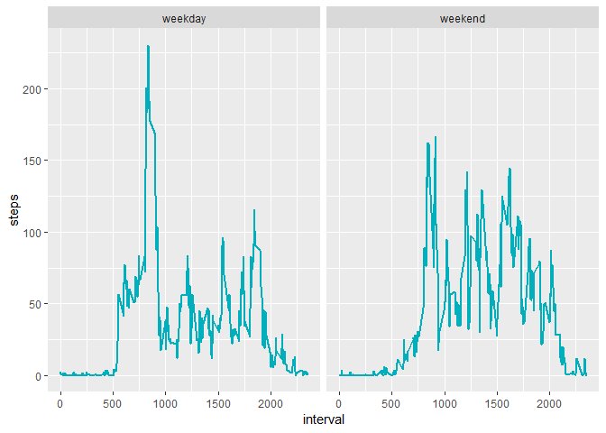

## R Markdown

*Load the necessary libraries*

```r
library("ggplot2")
library("readr")
```


## Loading and preprocessing the data


*We download the file in the working directory and keep only the rows without NAs*

```r
Data_full <- read_csv("activity.csv",guess_max = 40000)
```

```
## Parsed with column specification:
## cols(
##   steps = col_double(),
##   date = col_date(format = ""),
##   interval = col_double()
## )
```

```r
Data <- Data_full[complete.cases(Data_full),]
```


## What is mean total number of steps taken per day?

*We create an aggregation from the data frame which calculates the total of the steps for each day then we plot the histogram*

```r
m_steps<- aggregate(steps~date,data=Data,sum)
ggplot(data=m_steps, aes(x=steps))+ geom_histogram(bins = 10, color = "white")
```

<!-- -->

```r
paste(" Mean and median are: ",round(mean(m_steps$steps),2)," and ",round(median(m_steps$steps),2))
```

```
## [1] " Mean and median are:  10766.19  and  10765"
```


## What is the average daily activity pattern?

*We create an aggregation from the data frame which averages the steps for each interval*

```r
m_interval<- aggregate(steps~interval,data=Data,mean)
ggplot(data = m_interval, aes(x = interval, y = steps))+ geom_line(color = "#00AFBB", size = 1)
```

<!-- -->


```r
paste("The 5-minute interval that, on average, contains the maximum number of steps is : ",m_interval[m_interval$steps == max(m_interval$steps),"interval"]," for a max value of ",max(m_interval$steps))
```

```
## [1] "The 5-minute interval that, on average, contains the maximum number of steps is :  835  for a max value of  206.169811320755"
```


## Imputing missing values

*Here are the numers of NAs for each columns of the full file*

```r
colSums(is.na(Data_full))
```

```
##    steps     date interval 
##     2304        0        0
```
We see that missing values are for steps variable only.


*We will use the mean for the 5 min intervall, that is already stored in the data frame m_interval created above. There a function replaces the values of steps that are NA by the value of m_interval that fits the interval.*

```r
Data_full_new <- Data_full

Data_full_new$steps <- mapply(function(x,y) ifelse(is.na(x), m_interval[m_interval$interval==y,"steps"], x), Data_full_new$steps, Data_full_new$interval)
```


*We create an aggregation from the new data frame, which calculates the total of the steps for each day then we plot the new histogram*

```r
m_steps2<- aggregate(steps~date,data=Data_full_new,sum)
ggplot(data=m_steps2, aes(x=steps))+ geom_histogram(bins = 10, color = "white")
```

<!-- -->

```r
paste(" Mean and median are: ",round(mean(m_steps2$steps),2)," and ",round(median(m_steps2$steps),2))
```

```
## [1] " Mean and median are:  10766.19  and  10766.19"
```
The histogram is different: it shows that the imputing has added a lot of values above 10000 steps.
The mean stays the same and the median is now eqal to the mean.


## Are there differences in activity patterns between weekdays and weekends?

*We create a new column with the weekday : we first force local in english so that it could be reproductible*

```r
Sys.setlocale("LC_ALL","English")
```

```
## [1] "LC_COLLATE=English_United States.1252;LC_CTYPE=English_United States.1252;LC_MONETARY=English_United States.1252;LC_NUMERIC=C;LC_TIME=English_United States.1252"
```

```r
Data_full_new$day <- sapply(Data_full_new$date, function (x) ifelse(weekdays(x)%in%c("Saturday","Sunday"),"weekend","weekday")) 

md_interval<- aggregate(steps~interval+day,data=Data_full_new,mean)
ggplot(data = md_interval, aes(x = interval, y = steps))+ geom_line(color = "#00AFBB", size = 1)+facet_wrap(~day)
```

<!-- -->

There is a difference.
